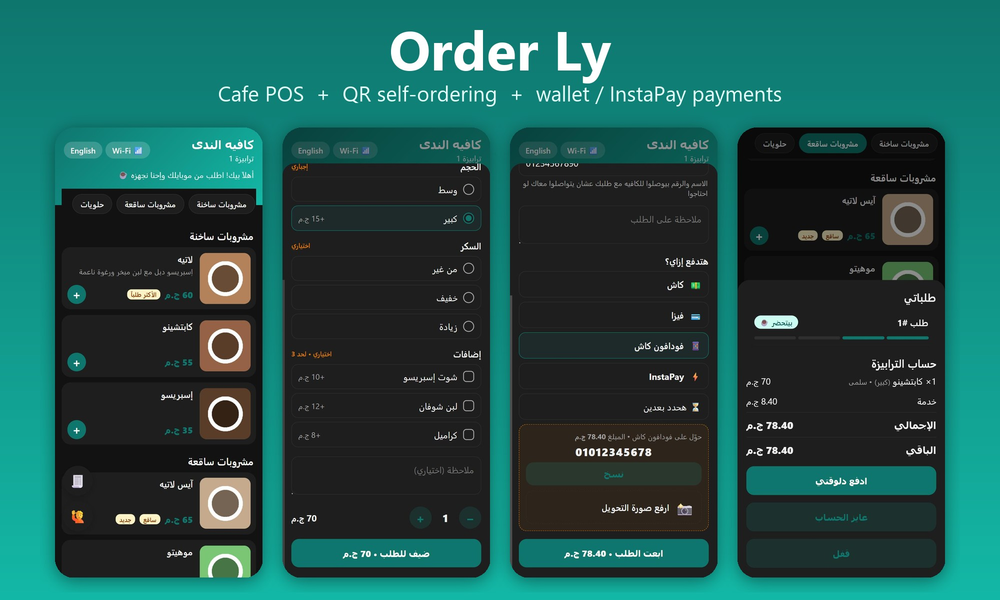
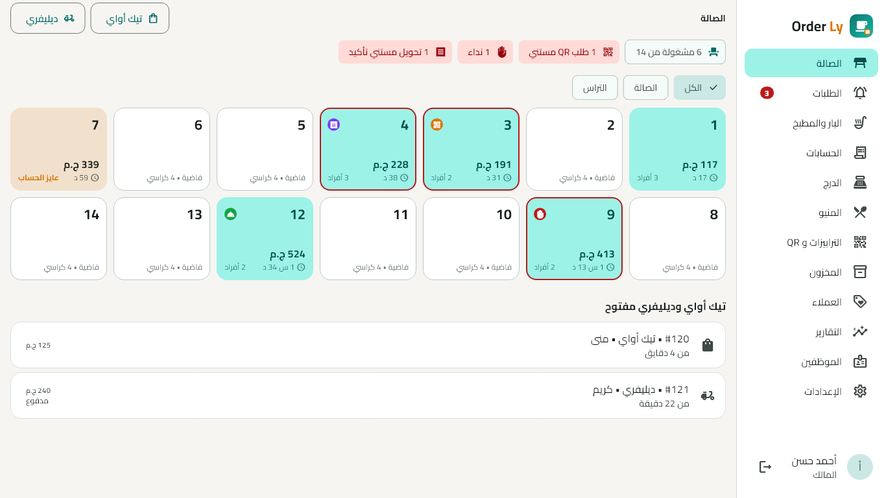
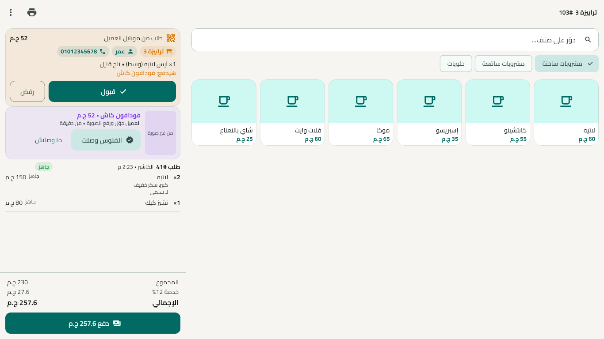
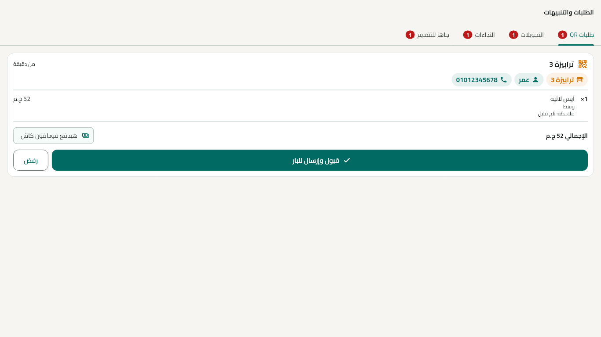
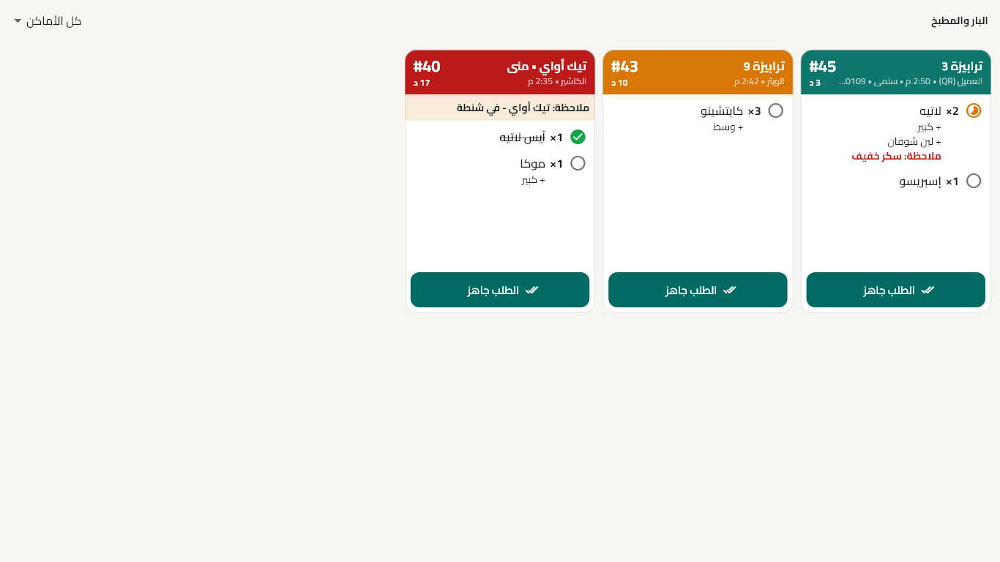
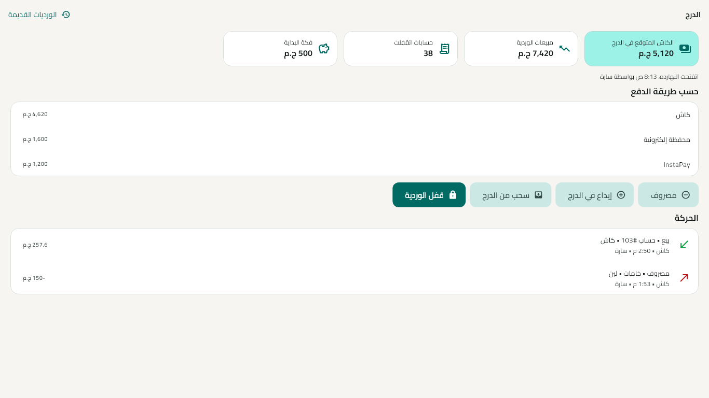
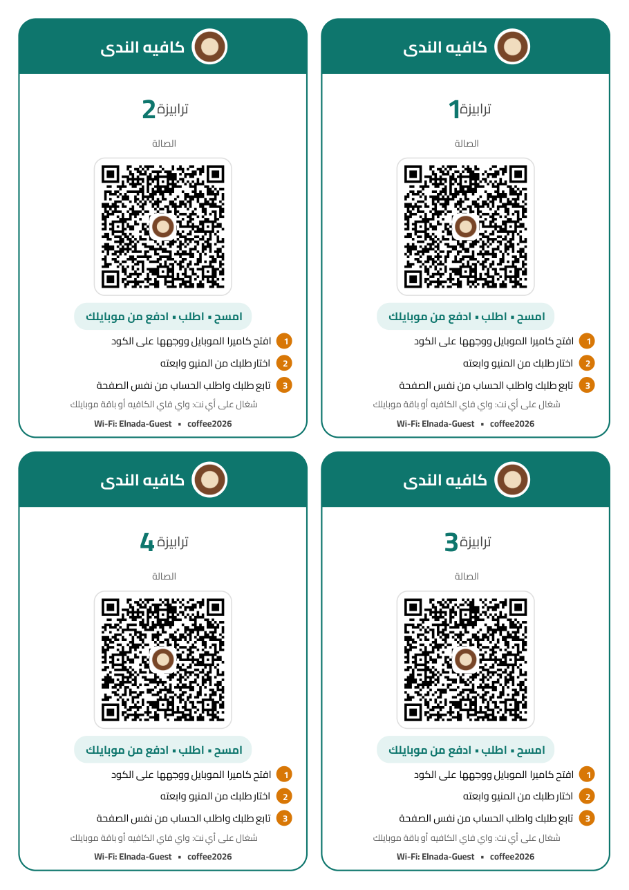

# Order Ly ☕

**Cafe POS + QR self-ordering.** Customers scan the QR on their table, order from their own phone, pay by wallet / InstaPay (and upload the transfer screenshot), and follow their order live. The cashier, waiters and the bar/kitchen work on the cafe's Wi-Fi — even when the internet is down.

**نظام كاشير للكافيهات + طلب بالـ QR.** العميل يمسح الكود على الترابيزة، يطلب من موبايله، يدفع بالمحفظة أو InstaPay ويرفع صورة التحويل، ويتابع طلبه لحظة بلحظة. والكاشير والويترز والبار والمطبخ شغالين على واي فاي الكافيه حتى لو النت قطع.



## Features

| Customer (QR web menu) | Cafe (Windows + Android app) |
|---|---|
| Photo menu, Arabic / English | Live table map (busy, bill requested, calling…) |
| Sizes, sugar, extras, notes, suggestions | POS check: move / merge / split, discount, service & tax |
| Name + phone with every order | QR orders inbox with sound alerts (approve or auto-accept) |
| Pay cash, card, Vodafone Cash / wallets, InstaPay + screenshot | Confirm transfers from the screenshot |
| Live status: waiting → preparing → ready → served | Bar / kitchen display + automatic ticket printing per station |
| Call waiter, ask for the bill, pay part of the bill, rate the visit | Recipe-based inventory (auto "sold out"), purchases, suppliers |
| Works on any internet (Wi-Fi or mobile data) | Happy-hour promotions, loyalty points by phone number |
| | Reports: real profit, peak hours, menu engineering, voids |
| | Printable QR cards with the cafe's name and logo |

| | |
|---|---|
|  |  |
|  |  |
|  |  |

## Reliability

- The cashier PC runs a local server in its own isolate; it **restarts itself** within seconds if it ever stops, and devices reconnect and refresh automatically.
- Heavy work (backups, photo shrinking, Excel) runs in background isolates, so the screen and the server never stall — stress-tested with thousands of orders.
- Freeze watchdog + `logs/` folder + "سجل المشاكل" screen to send diagnostics.
- Daily automatic backups (optionally to a second folder), SQLite health check on start.

## How it works

```
Customer phone ──► Firebase Hosting (menu page) ──► Firebase Realtime DB (inbox)
                                                          │  live (SSE)
Cashier PC: Order Ly app + local server (SQLite) ◄────────┘
     ▲  Wi-Fi (works offline)
Waiter phones • Bar / kitchen tablet • Ticket printers
```

## Project layout

| Folder | |
|---|---|
| `source/` | Flutter app (Windows + Android) and the local server (`lib/src/server`). Customer menu + database rules in `source/firebase/`. |
| `license-maker/` | Owner tool that issues activation codes (needs the private signing key, not in this repo). |
| `docs/` | Screenshots. |

```
cd source
flutter test                       # server + logic tests (temporary folders)
flutter test test_cloud            # live Firebase end-to-end test (cleans up after itself)
flutter test test_visual --update-goldens   # render UI screenshots
powershell -ExecutionPolicy Bypass -File tool\build_release.ps1   # Setup.exe + APKs
```

Built with Flutter, Dart (shelf + SQLite), Firebase Hosting & Realtime Database.
